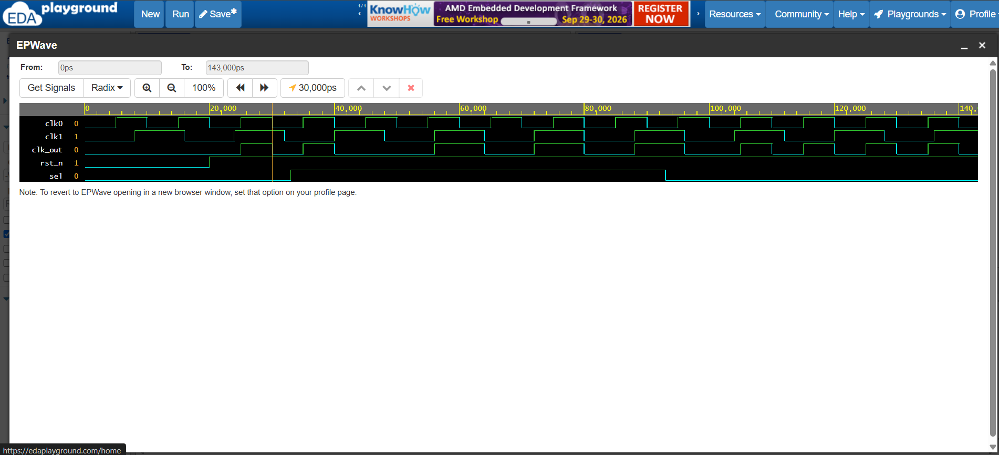

# Glitch-Free 2:1 Clock Multiplexer

A synthesizable digital circuit in Verilog implementing glitchless clock multiplexing between two independent, asynchronous clock sources.

## Problem Statement
Using standard combinational multiplexers (`assign clk_out = sel ? clk1 : clk0;`) causes runt pulses (narrow glitches) if the select line toggles when either clock input is at logic HIGH. These glitches violate downstream flip-flop setup and hold timing constraints, causing metastability in clock trees.

## Architectural Implementation
The design eliminates runt pulses using cross-coupled negative-edge D-flip-flops:
- **Negative-Edge Sampling**: The select condition is latched on the falling edge of the active clock domain, ensuring transfers occur only when the active clock is safely LOW.
- **Cross-Coupled Feedback Interlock**: Clock 1 cannot be enabled until the enable flag for Clock 0 (`q0`) has fully de-asserted to logic 0, and vice versa.
- **Output Gating**: Clock domains are gated with their synchronized enable signals and combined via an OR stage.

## Simulation & Verification
The design was verified in **Icarus Verilog** and visualized using **EPWave** under asynchronous clock frequencies:
- **clk0**: 100 MHz (Period: 10 ns)
- **clk1**: ~62.5 MHz (Period: 16 ns)

### Key Observations
1. **At t = 33 ns**: The `sel` signal toggles from `0` to `1` mid-pulse. `clk_out` completes its current low phase without early truncation.
2. **Deterministic Idle Phase**: A safe, low idle state is maintained during clock handover, guaranteeing zero runt pulses or duty cycle violations.

## Technical Interview Talking Points
- **Design Problem**: Standard multiplexers cause runt pulses/glitches during dynamic clock switching, leading to metastability in flip-flops.
- **Hardware Architecture**: Utilized dual negative-edge D-flip-flops with cross-coupled feedback to ensure the active clock deasserts to LOW before the incoming clock is enabled.
- **Verification**: Verified zero runt-pulse transitions across asynchronous 100 MHz and 62.5 MHz domains using Icarus Verilog and EPWave.
